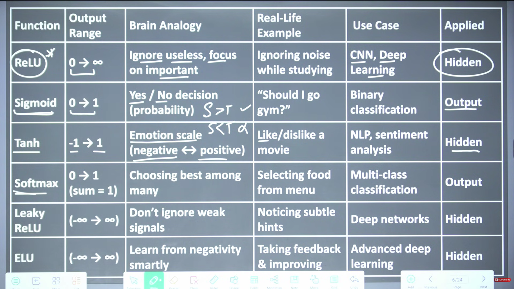

# Video Lecture & Concept Notes

A centralized collection of comprehensive study notes, architectural diagrams, mathematical derivations, and walkthroughs from curated educational video lectures.

---

## Table of Contents

1. [Artificial Neural Networks (ANN): Foundations, Mathematics &amp; Working Mechanism](#1-artificial-neural-networks-ann-foundations-mathematics--working-mechanism) *(Source: Gate Smashers - https://youtu.be/1TmUwRALJW0)*
2. [Why Activation Functions are Mandatory in Neural Networks](#2-why-activation-functions-are-mandatory-in-neural-networks) *(Source: Gate Smashers - https://youtu.be/hgARO7_a0n0)*
3. [Artificial Neural Networks (ANN) vs. Convolutional Neural Networks (CNN)](#3-artificial-neural-networks-ann-vs-convolutional-neural-networks-cnn) *(Source: Gate Smashers - https://youtu.be/o7n9OcvcHVY)*

---

# 1. Artificial Neural Networks (ANN): Foundations, Mathematics & Working Mechanism

**Source Video:** [Understand Artificial Neural Networks from Basics with Examples](https://youtu.be/1TmUwRALJW0?si=TD5XeL5_EXEUc9l3)
**Presenter:** Gate Smashers

---

## 1. Introduction & Motivation

An **Artificial Neural Network (ANN)** is the foundational, elementary building block of modern Artificial Intelligence, Deep Learning, and state-of-the-art Large Language Models (LLMs) such as Meta's LLaMA 3, OpenAI's ChatGPT (GPT-3 / GPT-4), and Google's Gemini / Bard.

* **Conceptual Analogy:** ANN represents the *nursery/elementary foundation* of AI. Advanced architectures (LLMs, Transformers, Multi-Agent Systems) represent *post-graduate / PhD level* applications. One cannot master advanced systems without thoroughly mastering this foundational base.
* **Core Objective:** To mathematically **mimic the human brain**—how biological neurons receive sensory input, process stimuli through interconnected pathways, learn from experience, and generate decisions or predictions.

```
┌─────────────────────────────────────────────────────────────────────────┐
│                       Evolution of Modern AI                            │
│                                                                         │
│   ┌─────────────────────┐        ┌─────────────────┐        ┌─────────┐ │
│   │ Single / Multi-Layer│ ────-> │ Deep Neural     │ ────-> │ LLMs &  │ │
│   │ Perceptrons (ANN)   │        │ Networks (DNNs) │        │ GenAI   │ │
│   └─────────────────────┘        └─────────────────┘        └─────────┘ │
│       (Foundational)                (Intermediate)           (Advanced) │
└─────────────────────────────────────────────────────────────────────────┘
```

---

## 2. Core Components of an Artificial Neural Network

A functional Artificial Neural Network consists of four fundamental architectural elements:

```
                  Input Layer             Hidden Layer(s)             Output Layer
                 (Features X)         (Feature Transformations)       (Prediction Ŷ)

                    ┌───┐                      ┌───┐                      ┌───┐
      Input X₁ ───> │   │ ───────────────────> │   │ ───────────────────> │   │ ───> Output Ŷ
                    └───┘   ╲              ╱   └───┘   ╲              ╱   └───┘
                             ╲   Weights  ╱             ╲   Weights  ╱
                              ╲    (W)   ╱               ╲    (W)   ╱
                    ┌───┐      ╲        ╱      ┌───┐      ╲        ╱
      Input X₂ ───> │   │ ──────╳──────╳─────> │   │ ──────╳──────╳──
                    └───┘      ╱        ╲      └───┘      ╱        ╲
                             ╱   Biases   ╲             ╱   Biases   ╲
                            ╱     (b)      ╲           ╱     (b)      ╲
                    ┌───┐  ╱                ╲  ┌───┐  ╱                ╲  ┌───┐
      Input Xₙ ───> │   │ ───────────────────> │   │ ───────────────────> │   │
                    └───┘                      └───┘                      └───┘
```

### 1. Neurons (Nodes)

* The basic processing and storage units of a neural network.
* Each neuron stores a numerical activation state, receives incoming numerical inputs, applies mathematical transformations, and transmits the resulting signal to downstream connected neurons.

### 2. Layers

* **Input Layer:** Receives external raw feature data ($X_1, X_2, \dots, X_n$). It performs no mathematical transformation; it merely distributes the inputs.
* **Hidden Layer(s):** Intermediate computational layers situated between the input and output layers. They extract hierarchical patterns, non-linear relationships, and intermediate representations.
* **Output Layer:** Generates the final network prediction ($\hat{Y}$), which may be a continuous regression value or a discrete class probability distribution.

### 3. Connections, Weights ($W$) & Biases ($b$)

* **Weights ($W$):** Every directed connection between two neurons has an associated scalar weight representing the **strength and significance** of that specific signal.
  * A positive weight indicates an excitatory / positive relationship.
  * A negative weight indicates an inhibitory / inverse relationship.
* **Bias ($b$):** An independent trainable parameter added to the weighted sum. It shifts the activation function curve horizontally, allowing the neuron to activate even when inputs are zero or low.

### 4. Activation Functions

* **Purpose:** Introduces non-linearity into the network. Without activation functions, stacking multiple layers would still result in a simple linear regression model ($W_2(W_1X) = W'X$).
* **Range Normalization:** Constrains unbounded raw linear outputs ($-\infty$ to $+\infty$) into a well-behaved interval (e.g., $[0, 1]$ or $[-1, 1]$).
* **Common Activation Functions:**
  * **Sigmoid:** $\sigma(z) = \frac{1}{1 + e^{-z}}$ $\rightarrow$ Compresses output into $[0, 1]$ (ideal for probability estimation).
  * **ReLU (Rectified Linear Unit):** $f(z) = \max(0, z)$ $\rightarrow$ Fast, computationally efficient, avoids vanishing gradients.
  * **Tanh:** $f(z) = \frac{e^z - e^{-z}}{e^z + e^{-z}}$ $\rightarrow$ Zero-centered output in $[-1, 1]$.

---

## 3. Cognitive Analogy: How Humans and ANNs Learn

### Feature Decomposition (Recognizing the Digit '4')

When a young child learns to identify the handwritten number **'4'**, the brain breaks the complex visual pattern down into primitive sub-features:

1. A vertical downward stroke.
2. A perpendicular horizontal bar.
3. An intersecting vertical line.

```
       Visual Input                     Feature Extraction              Mental Recognition
    ┌────────────────┐                 ┌────────────────────┐          ┌──────────────────┐
    │  Raw Image of  │ ──────────────> │ Stroke 1: Vertical │ ───────> │ Identified as:   │
    │  Handwritten   │                 │ Stroke 2: Horizon. │          │ Digit '4'        │
    │  Number '4'    │                 │ Stroke 3: Intersect│          │                  │
    └────────────────┘                 └────────────────────┘          └──────────────────┘
```

* **The Learning Process:**
  * At first, the child makes approximate guesses.
  * Through repeated teacher feedback, the child's brain adjusts internal synaptic strengths (analogous to **tuning weights & biases** in an ANN).
  * Once trained, even if the child sees a messy, imperfect, or hand-drawn '4', the brain matches the underlying features against the stored representation and accurately recognizes the digit.

---

## 4. Mathematical Walkthrough & Concrete Numerical Example

Consider a single-layer neural network designed to predict whether a student will **Pass ($Y=1$)** or **Fail ($Y=0$)** an examination based on daily lifestyle habits.

```
                   Input Layer               Linear Combination & Activation        Output Layer
                 
                 ┌─────────────┐                          W₁
   Study Hours   │   X₁ = 2    │ ──────────────────────────────────────────────┐
                 └─────────────┘                                               │
                                                                               ▼
                                                                        ┌──────────────┐
                                                                        │  Z = ∑(W·X)+b│ ───> Ŷ (Probability)
                                                                        │  Ŷ = σ(Z)    │
                                                                        └──────────────┘
                 ┌─────────────┐                          W₂                   ▲
   Sleep Hours   │   X₂ = 8    │ ──────────────────────────────────────────────┘
                 └─────────────┘
                                                      Bias b
```

### Step 1: Forward Propagation Equation

The linear combination $Z$ (pre-activation) and output $\hat{Y}$ (post-activation) are computed as:

$$
Z = (X_1 \cdot W_1) + (X_2 \cdot W_2) + b
$$

$$
\hat{Y} = \sigma(Z) = \frac{1}{1 + e^{-Z}}
$$

---

### Step 2: Numerical Case Study 1 — Low Study, High Sleep

* **Input Data:**
  * $X_1 = 2 \text{ hours}$ (Study time)
  * $X_2 = 8 \text{ hours}$ (Sleep time)
* **Learned / Adjusted Model Parameters:**
  * $W_1 = +0.5$ (Study has a positive contribution toward passing)
  * $W_2 = -0.3$ (Excessive sleep has a negative correlation in this dataset)
  * $b = +0.1$ (Initial bias term)

#### Calculation:

1. **Weighted Linear Sum ($Z$):**

   $$
   Z = (2 \times 0.5) + (8 \times -0.3) + 0.1
   $$

   $$
   Z = 1.0 - 2.4 + 0.1 = -1.3
   $$
2. **Sigmoid Activation Function:**

   $$
   \hat{Y} = \sigma(-1.3) = \frac{1}{1 + e^{-(-1.3)}} = \frac{1}{1 + e^{1.3}} \approx \frac{1}{1 + 3.669} \approx \mathbf{0.214}
   $$
3. **Classification Decision:**

   * Calculated probability of passing: $\mathbf{21.4\%}$
   * Decision threshold $= 0.5 \implies \mathbf{Fail\ (0)}$.

---

### Step 3: Numerical Case Study 2 — High Study, Balanced Sleep

* **Input Data:**
  * $X_1 = 6 \text{ hours}$ (Study time)
  * $X_2 = 7 \text{ hours}$ (Sleep time)
* **Parameters (Same Model):**
  * $W_1 = +0.5$, $W_2 = -0.3$, $b = +0.1$

#### Calculation:

1. **Weighted Linear Sum ($Z$):**

   $$
   Z = (6 \times 0.5) + (7 \times -0.3) + 0.1
   $$

   $$
   Z = 3.0 - 2.1 + 0.1 = \mathbf{+1.0}
   $$
2. **Sigmoid Activation Function:**

   $$
   \hat{Y} = \sigma(+1.0) = \frac{1}{1 + e^{-1.0}} \approx \frac{1}{1 + 0.3678} \approx \mathbf{0.731}
   $$
3. **Classification Decision:**

   * Calculated probability of passing: $\mathbf{73.1\%}$
   * Decision threshold $= 0.5 \implies \mathbf{Pass\ (1)}$.

---

## 5. Training, Loss & Backpropagation Optimization Loop

The fundamental objective of training a neural network is not merely calculating an output—any formula produces an output. The real objective is to **discover the optimal parameters ($W^*, b^*$)** that minimize predictive error across massive datasets.

```
       ┌─────────────────┐
       │   Input Data    │
       │    (X₁, X₂)     │
       └────────┬────────┘
                │
                ▼
       ┌─────────────────┐        Forward Pass
       │ Compute Output  │ ──────────────────────────┐
       │   Ŷ = σ(W·X + b)│                           │
       └─────────────────┘                           ▼
                ▲                           ┌──────────────────┐
                │ Backward Pass             │ Calculate Loss / │
                │ (Update Weights & Bias)   │ Error (Y - Ŷ)    │
                │                           └────────┬─────────┘
                │                                    │
       ┌────────┴────────┐                           │
       │ Backpropagation │ <─────────────────────────┘
       │ Gradient Descent│
       └─────────────────┘
```

### 1. Initial Guess (Random Initialization)

* At epoch 0, weights ($W$) and biases ($b$) are assigned small random values. Initial predictions are essentially random guesses.

### 2. Loss / Error Computation

* The predicted output $\hat{Y}$ is compared against the ground truth target $Y$ using a loss function (e.g., Mean Squared Error or Binary Cross-Entropy):
  $$
  \mathcal{L} = -(Y \log(\hat{Y}) + (1 - Y) \log(1 - \hat{Y}))
  $$

### 3. Backpropagation & Parameter Update

* Gradients of the loss with respect to each weight and bias ($\frac{\partial \mathcal{L}}{\partial W}, \frac{\partial \mathcal{L}}{\partial b}$) are calculated using the mathematical **Chain Rule**.
* Parameters are updated via **Gradient Descent**:

  $$
  W_{\text{new}} = W_{\text{old}} - \alpha \frac{\partial \mathcal{L}}{\partial W}
  $$

  $$
  b_{\text{new}} = b_{\text{old}} - \alpha \frac{\partial \mathcal{L}}{\partial b}
  $$

  *(where $\alpha$ is the learning rate)*.

### 4. Convergence

* This forward $\rightarrow$ loss $\rightarrow$ backward update loop is repeated across thousands of iterations until loss converges to a global minimum and prediction accuracy reaches the target threshold.

---

## 6. Summary of Key Concepts

| Component                     | Technical Role                                | Practical Intuition                     |
| :---------------------------- | :-------------------------------------------- | :-------------------------------------- |
| **Neuron / Node**       | Stores numerical value & applies activation   | Cognitive processing unit               |
| **Weight ($W$)**      | Multiplier defining feature importance        | Connection strength between ideas       |
| **Bias ($b$)**        | Constant offset shifting activation threshold | Base inclination / baseline prior       |
| **Activation Function** | Introduces non-linearity & bounds outputs     | Firing threshold of a biological neuron |
| **Forward Propagation** | Computes predictions from inputs              | Reasoning from evidence to conclusion   |
| **Loss Function**       | Quantifies prediction discrepancy             | Measuring how far off the guess was     |
| **Backpropagation**     | Computes parameter gradients via chain rule   | Learning from mistakes to improve       |

---

# 2. Why Activation Functions are Mandatory in Neural Networks

**Source Video:** [Why Activation Function is Must in ANN | Artificial Neural Network](https://youtu.be/hgARO7_a0n0?si=eAgRAXGo2z57t4J7)
**Presenter:** Gate Smashers

---

## 1. Core Problem: The Failure of Linear Networks

In Artificial Neural Networks, why can we not simply multiply inputs by weights, sum them with a bias, and pass the result straight to the output layer?

* **Common Student Misconception:** Stacking multiple hidden layers with hundreds of neurons will automatically make the model deep and powerful.
* **The Mathematical Reality:** **Without an activation function, any neural network—regardless of how many layers or neurons it possesses—collapses into a simple Linear Regression model.**
* Linear transformations stacked on top of linear transformations yield only another linear transformation ($f(g(x)) = W_2(W_1 x + b_1) + b_2 = W^* x + b^*$).
* Since real-world phenomena (e.g., image features, human speech, medical diagnoses, stock markets) are non-linear, a pure linear network cannot solve or learn complex tasks.

```
┌───────────────────────────────────────────────────────────────────────────┐
│              Linear vs. Non-Linear Decision Boundaries                    │
│                                                                           │
│   Linear Model (No Activation)              Non-Linear Model (With Act.) │
│   ───────────────────────────               ──────────────────────────── │
│          Class B                                   Class B                │
│             o   o                                     o     o             │
│          o   o   o                                 o   ╭───╮   o          │
│       ─────────────── Boundary                     │   │ A │   │          │
│          x   x   x                                 o   ╰───╯   o          │
│             x   x                                     o     o             │
│          Class A                                   Class B                │
│                                                                           │
│   * Only separates straight lines           * Can learn arbitrary,        │
│   * Cannot solve XOR problem                  curved, enclosed boundaries │
└───────────────────────────────────────────────────────────────────────────┘
```

---

## 2. Real-Life Analogy: The Coffee Shop Order

To intuitively understand the difference between a linear and a non-linear decision-making system, consider ordering at a coffee shop:

```
┌─────────────────────────────────────────────────────────────────────────┐
│                      The Coffee Order Decision System                   │
│                                                                         │
│  Rigid / Linear Behavior:                                               │
│  Always order "Cappuccino" by default, ignoring all outside conditions. │
│                                                                         │
│  Dynamic / Non-Linear Behavior (Context-Aware):                         │
│  ┌────────────────────────┐                  ┌────────────────────────┐ │
│  │ Extreme Heat Outside   │ ───────────────> │ Cold / Iced Coffee     │ │
│  ├────────────────────────┤                  ├────────────────────────┤ │
│  │ Freezing Winter Weather│ ───────────────> │ Hot Espresso           │ │
│  ├────────────────────────┤                  ├────────────────────────┤ │
│  │ High Fatigue / Exhaust.│ ───────────────> │ Strong Dark Roast      │ │
│  ├────────────────────────┤                  ├────────────────────────┤ │
│  │ Pre-Workout / Gym Bound│ ───────────────> │ Black Coffee           │ │
│  └────────────────────────┘                  └────────────────────────┘ │
└─────────────────────────────────────────────────────────────────────────┘
```

* **Linear Behavior:** Blindly outputs the exact same default response regardless of external inputs. It cannot adapt to changing environmental conditions.
* **Non-Linear Behavior:** Dynamically shifts decisions based on combinations of conditions.
* **The Role of Activation Functions:** They introduce the non-linear "switch" that allows a neural network to evaluate multifaceted context and alter its behavior dynamically.

---

## 3. Mathematical Proof: Linear Collapse in Multi-Layer Networks

Let us mathematically prove why stacking hidden layers without an activation function produces nothing more than a single-layer linear model.

```
           Input Layer               Hidden Layer               Output Layer
          (Features X)               (Neurons h)                 (Output Z)

             ┌───┐         W₁₁          ┌────┐          W'₁
       X₁ ──>│   │ ───────────────────> │ h₁ │ ────────────────────┐
             └───┘ ╲                  ╱ └────┘                     │
                    ╲     W₂₁        ╱                             ▼
                     ╲              ╱                           ┌─────┐
                      ╳────────────╳                            │  Z  │ ──> Output
                     ╱              ╲                           └─────┘
                    ╱     W₁₂        ╲                             ▲
             ┌───┐ ╱                  ╲ ┌────┐          W'₂        │
       X₂ ──>│   │ ───────────────────> │ h₂ │ ────────────────────┘
             └───┘         W₂₂          └────┘
```

### Step 1: Forward Equations for Hidden Neurons

For hidden neurons $h_1$ and $h_2$ with input features $X_1, X_2$ and bias terms $b_1, b_2$:

$$
h_1 = (W_{11} \cdot X_1) + (W_{21} \cdot X_2) + b_1
$$

$$
h_2 = (W_{12} \cdot X_1) + (W_{22} \cdot X_2) + b_2
$$

---

### Step 2: Output Neuron Equation

The output neuron $Z$ computes a linear combination of $h_1$ and $h_2$ with output bias $b_{\text{out}}$:

$$
Z = (W'_1 \cdot h_1) + (W'_2 \cdot h_2) + b_{\text{out}}
$$

---

### Step 3: Direct Algebraic Substitution

Substitute the definitions of $h_1$ and $h_2$ directly into the equation for $Z$:

$$
Z = W'_1 \Big(W_{11} X_1 + W_{21} X_2 + b_1\Big) + W'_2 \Big(W_{12} X_1 + W_{22} X_2 + b_2\Big) + b_{\text{out}}
$$

Expanding the terms:

$$
Z = \Big(W'_1 W_{11} X_1 + W'_1 W_{21} X_2 + W'_1 b_1\Big) + \Big(W'_2 W_{12} X_1 + W'_2 W_{22} X_2 + W'_2 b_2\Big) + b_{\text{out}}
$$

Regrouping by input variables $X_1$ and $X_2$:

$$
Z = \underbrace{\Big(W'_1 W_{11} + W'_2 W_{12}\Big)}_{W^*_1} X_1 + \underbrace{\Big(W'_1 W_{21} + W'_2 W_{22}\Big)}_{W^*_2} X_2 + \underbrace{\Big(W'_1 b_1 + W'_2 b_2 + b_{\text{out}}\Big)}_{b^*}
$$

### Conclusion of the Proof:

$$
Z = W^*_1 X_1 + W^*_2 X_2 + b^*
$$

* $W^*_1$, $W^*_2$, and $b^*$ are simply constant scalar numbers.
* The entire 2-layer network has collapsed into a single linear equation: **$Z = W^* X + b^*$**.
* Whether you add $2$, $10$, or $1,000$ hidden layers, without a non-linear activation function between layers, the network is mathematically equivalent to a single linear regression model.

---

## 4. Output Bounding & Numerical Stability in Optimization

Beyond introducing non-linearity, activation functions serve a critical role in **constraining outputs and stabilizing gradient descent**:

```
      Without Activation Function              With Activation Function (e.g., Sigmoid)
      ───────────────────────────              ────────────────────────────────────────
      X₁ = 10,  W₁ = 30                        Z = 1300
      X₂ = 20,  W₂ = 50                      
      Z = (10·30) + (20·50) = 1300             σ(Z) = 1 / (1 + e⁻¹³⁰⁰) = 1.0 (Bounded!)
    
      * Unbounded outputs (-∞ to +∞)           * Outputs strictly bounded in [0, 1]
      * Causes exploding gradients             * Numerically stable for backpropagation
      * Destabilizes weight updates            * Directly interpretable as probabilities
```

* **Exploding Activations:** Without activation functions, deep networks generate exponentially massive numerical values ($Z = 10^3, 10^6, \dots$).
* **Gradient Instability:** Huge values lead to unstable partial derivatives during backpropagation ($\frac{\partial \mathcal{L}}{\partial W}$), causing weights to diverge or oscillate wildly.
* **Controlled Optimization:** Activation functions squash activations into well-defined numerical boundaries ($[0, 1]$ or $[-1, +1]$), ensuring stable, smooth convergence.

---

## 5. Overview of Essential Activation Functions

```
                      Common Activation Function Profiles
                    
       Sigmoid: [0, 1]              Tanh: [-1, +1]               ReLU: [0, ∞)
            1 ┌─────                    1 ┌─────                   ∞ ┌       /
              │  /                        │  /                       │      /
          0.5 ┼─/─                      0 ┼──/──                   0 ┼─────/
              │/                         -1 ─────/                   └───────
            0 └─────                                                -∞   0  +∞
```

### 1. ReLU (Rectified Linear Unit)

* **Mathematical Formula:** $f(z) = \max(0, z)$
* **Primary Use Case:** Default choice for **hidden layers** in deep neural networks.
* **Advantages:** Extremely fast to compute, introduces sparse representations, and completely avoids the vanishing gradient problem for positive activations.

### 2. Sigmoid ($\sigma$)

* **Mathematical Formula:** $\sigma(z) = \frac{1}{1 + e^{-z}}$
* **Output Range:** $(0, 1)$
* **Primary Use Case:** **Binary Classification** output layers (e.g., Spam vs. Ham, Pass vs. Fail, Tumor vs. Healthy).
* **Advantage:** Directly represents class probability distribution.

### 3. Softmax

* **Mathematical Formula:** $\text{Softmax}(z_i) = \frac{e^{z_i}}{\sum_{j} e^{z_j}}$
* **Primary Use Case:** **Multi-Class Classification** output layers (e.g., choosing among Cold Coffee, Cappuccino, Latte, Espresso).
* **Advantage:** Normalizes a vector of logits into a probability distribution where all values sum to $1.0$ ($\sum P_i = 1$).

### 4. Tanh (Hyperbolic Tangent)

* **Mathematical Formula:** $f(z) = \frac{e^z - e^{-z}}{e^z + e^{-z}}$
* **Output Range:** $(-1, +1)$
* **Primary Use Case:** Hidden layers where zero-centered outputs are required to speed up optimization.

### 5. Leaky ReLU

* **Mathematical Formula:** $f(z) = \max(\alpha z, z)$ *(where $\alpha \approx 0.01$)*
* **Advantage:** Prevents the **"Dying ReLU"** problem by ensuring a small non-zero gradient flows even when inputs are negative.

---

## 6. Summary Comparison Matrix

| Activation Function     | Mathematical Equation                 | Output Range                                                                        | Ideal Layer Placement      | Core Purpose                                |
| :---------------------- | :------------------------------------ | :---------------------------------------------------------------------------------- | :------------------------- | :------------------------------------------ |
| **None (Linear)** | $f(z) = z$                          | $(-\infty, +\infty)$                                                              | Linear Regression          | Fails to learn non-linear patterns          |
| **ReLU**          | $\max(0, z)$                        | $[0, +\infty)$                                                                    | Hidden Layers              | High efficiency, avoids vanishing gradients |
| **Sigmoid**       | $\frac{1}{1 + e^{-z}}$              | $(0, 1)$ | Output Layer (Binary) | Outputs class probabilities ($P \in [0, 1]$) |                            |                                             |
| **Softmax**       | $\frac{e^{z_i}}{\sum e^{z_j}}$      | $(0, 1), \sum=1$                                                                  | Output Layer (Multi-class) | Categorical probability distribution        |
| **Tanh**          | $\frac{e^z - e^{-z}}{e^z + e^{-z}}$ | $(-1, +1)$                                                                        | Hidden Layers              | Zero-centered normalized activations        |
| **Leaky ReLU**    | $\max(0.01z, z)$                    | $(-\infty, +\infty)$                                                              | Hidden Layers              | Solves dying neuron problem                 |



---

# 3. Artificial Neural Networks (ANN) vs. Convolutional Neural Networks (CNN)

**Source Video:** [Artificial vs. Convolutional Neural Network with Real Life Examples | Beginners Friendly](https://youtu.be/o7n9OcvcHVY?si=4XgHKk7c6ueOm4sN)
**Presenter:** Gate Smashers

---

## 1. Introduction: The Need for Spatial Vision in AI

While general-purpose **Artificial Neural Networks (ANN / Multi-Layer Perceptrons)** are effective for tabular, 1D numerical, and structured text data, modern AI operates predominantly in a visual world.

* **The Global Data Reality:** Approximately **85% to 90%** of all data generated globally exists in the form of **images and video streams**. Tabular, spreadsheet, and simple text data comprise only **10% to 15%**.
* **The Paradigm Shift:** Processing high-dimensional visual data requires architectures with **spatial intelligence**—the ability to understand spatial hierarchies, pixel neighborhood relationships, and geometric transformations.
* **The Solution:** **Convolutional Neural Networks (CNNs)** are specialized deep learning architectures designed explicitly to process 2D/3D spatial grids (images, video frames, volumetric scans).

```
┌─────────────────────────────────────────────────────────────────────────┐
│                    Global Data Composition & Network Suitability        │
│                                                                         │
│   ┌─────────────────────────────────────────────────────────────────┐   │
│   │ Image & Video Data (~85% - 90%)                                 │   │
│   │ ───> Requires CNN (Spatial Feature Learning, Convolutions)      │   │
│   └─────────────────────────────────────────────────────────────────┘   │
│   ┌─────────────────────────────────┐                                   │
│   │ Tabular & Text (~10% - 15%)     │                                   │
│   │ ───> Handled well by ANN / MLPs │                                   │
│   └─────────────────────────────────┘                                   │
└─────────────────────────────────────────────────────────────────────────┘
```

---

## 2. Why Standard ANNs Fail for Images (The 3 Critical Bottlenecks)

An image is mathematically a **2D or 3D grid of pixel intensities** ($0 \le \text{pixel} \le 255$ across Grayscale or Red-Green-Blue channels). When a standard ANN attempts to process image data, it encounters three fundamental flaws:

```
            2D Image Grid (4×4)                     Flattened 1D Vector for ANN
         ┌───┬───┬───┬───┐
      Row 1 │ 1 │ 2 │ 3 │ 4 │                      ┌───┬───┬───┬───┬───┬───┬───┬───────┐
         ├───┼───┼───┼───┤   Flattening / Vectorize│ 1 │ 2 │ 3 │ 4 │ 5 │ 6 │ 7 │... 16│
      Row 2 │ 5 │ 6 │ 7 │ 8 │ ────────────────────> └───┴───┴───┴───┴───┴───┴───┴───────┘
         ├───┼───┼───┼───┤                           ▲
      Row 3 │ 9 │ 10│ 11│ 12│                           │ ❌ Loss of 2D Neighborhood Context!
         ├───┼───┼───┼───┤                           │    Pixel (1) loses connection to (5)
      Row 4 │ 13│ 14│ 15│ 16│                           │    which sat right beneath it!
         └───┴───┴───┴───┘
```

### 1. Destruction of 2D/3D Spatial Context (The Flattening Problem)

* In an ANN, multi-dimensional images must be flattened into a 1D vector before being passed to the input layer.
* **Loss of Spatial Proximity:** In a 2D image, pixel $(1, 1)$ is adjacent to pixel $(2, 1)$ directly below it. Once flattened, these pixels become separated by an arbitrary sequence of numbers.
* The network completely loses structural concepts like *edges, contours, curves, corners, and textures*.

### 2. Combinatorial Explosion of Parameters (High Computational Cost)

* In an ANN, **every input neuron connects to every neuron in the subsequent layer** (Dense / Fully Connected).
* Consider a relatively small color image of size $200 \times 200 \times 3$ (120,000 pixels):
  $$
  \text{Inputs} = 200 \times 200 \times 3 = 120,000\text{ input neurons}
  $$
* Connecting this single input to a moderate hidden layer of $1,000$ neurons requires:
  $$
  \text{Weights} = 120,000 \times 1,000 = \mathbf{120,000,000\text{ (120 Million Parameters)}}
  $$
* This leads to immense memory usage, painfully slow training, and severe **overfitting** (the model memorizes noise rather than generalizable features).

### 3. Lack of Spatial / Translation Invariance

* If an object moves slightly within the frame (e.g., a person shifts from left to right in a selfie, or a car appears in the top-right corner of a surveillance camera), an ANN treats it as a completely distinct, unrelated set of active inputs.
* An ANN cannot generalize positional shifts without seeing millions of redundant shifted images.

---

## 3. How CNN Solves These Problems (Architectural Innovations)

Rather than directly connecting all raw pixels to dense neurons, a **Convolutional Neural Network** introduces localized, parameter-efficient feature extraction stages:

```
    Input Image           Convolution + ReLU              Pooling Layer              Dense / Output
    (Preserves 2D)        (Feature Maps / Filters)        (Downsampling)             (Classification)
  
     ┌───────────┐           ┌───────────┐                 ┌───────┐                   ┌───┐
     │ 2D Matrix │ ──[Conv]─>│ Edges &   │ ──[Max Pool]───>│ Sharp │ ──[Flatten]─────> │   │ ─> Class
     │ (H × W × C)│   Filter  │ Textures  │    (H/2, W/2)   │ Patterns│  (at the end)   └───┘
     └───────────┘           └───────────┘                 └───────┘
```

### 1. Convolutional Layers (Hierarchical Feature Extractors)

* Instead of full connectivity, small trainable filters / kernels (e.g., $3 \times 3$ or $5 \times 5$) slide across the 2D image grid via a mathematical **dot-product convolution**.
* **Weight Sharing (Parameter Sharing):** A single $3 \times 3$ kernel has only $9$ weights, which are shared across the entire image. This reduces parameters from millions down to a tiny fraction.
* **Hierarchical Learning:**
  * *Early Layers:* Detect low-level primitives (horizontal/vertical edges, color gradients, texture lines).
  * *Middle Layers:* Combine edges into complex geometric parts (curves, circles, corners, eyes, wheels).
  * *Deep Layers:* Assemble parts into holistic semantic objects (faces, cars, tumors, dogs).

### 2. Pooling Layers (Spatial Dimension Reduction)

* Applies sliding windows (typically $2 \times 2$ Max Pooling with stride 2) to condense feature maps.
* Halves spatial height and width ($H/2, W/2$), reducing computational workload while retaining the most prominent activation signals.
* Imparts **Translation Invariance**: The model recognizes the object even if it is rotated, scaled, or shifted in the frame.

### 3. Fully Connected (FC) Layers at the Tail

* Once high-level feature vectors have been extracted and condensed by convolutional and pooling blocks, they are flattened into a compact vector for the final dense layers to output the classification decision.

---

## 4. Real-World Applications: When to Use ANN vs. CNN

```
┌─────────────────────────────────────────────────────────────────────────┐
│                      Industry Application Domains                       │
│                                                                         │
│   Use Artificial Neural Networks (ANN)     Use Convolutional Nets (CNN) │
│   ────────────────────────────────────     ──────────────────────────── │
│   📊 Loan Eligibility & Credit Scoring     🚗 Autonomous Vehicles / Cars│
│   💳 Fraud & Risk Detection (Tabular)      🏥 Medical Imaging (X-Ray/CT)│
│   📧 Spam Classification (Text/Tabular)    👤 Facial Recognition & Bio. │
│   📈 Stock Market & Sales Forecasting      🛰️ Satellite Remote Sensing  │
│   🛒 Customer Churn Prediction             🔍 Real-time Object Detection│
└─────────────────────────────────────────────────────────────────────────┘
```

### When to Choose CNN:

1. **Self-Driving Vehicles:** Real-time road perception, pedestrian tracking, traffic sign identification from continuous video camera feeds.
2. **Medical Diagnostics:** Detecting anomalies in 2D/3D radiology scans (X-rays, MRIs, Ultrasounds, CT scans) such as tumors, lesions, or bone fractures.
3. **Facial Recognition & Surveillance:** Biometric verification, security cameras, and mobile face unlock systems capable of handling varying angles and lighting.

### When to Choose ANN:

1. **Tabular & Structured Business Data:** Predicting customer loan defaults, insurance claim risk, or employee turnover based on spreadsheet attributes.
2. **Natural Language / Text Classification:** Binary spam filtering (Spam vs. Ham), sentiment analysis on customer reviews.
3. **Time-Series / Numerical Forecasting:** Predicting sales metrics or financial indicators from historic tabular records.

---

## 5. Comprehensive Comparison: ANN vs. CNN

| Feature / Dimension                | Artificial Neural Network (ANN)                                                                                             | Convolutional Neural Network (CNN)                                                                        |
| :--------------------------------- | :-------------------------------------------------------------------------------------------------------------------------- | :-------------------------------------------------------------------------------------------------------- |
| **Primary Data Type**        | 1D Tabular, structured numerical, text data                                                                                 | 2D / 3D Spatial data (Images, Video frames, Scans)                                                        |
| **Input Structure**          | Requires flattened 1D feature vector ($X_1, X_2, \dots$) | Directly accepts 2D/3D matrices ($H \times W \times C$)      |                                                                                                           |
| **Connectivity Pattern**     | **Fully Connected (Dense)**: Every node connects to all next nodes                                                    | **Locally Connected**: Neurons connect only to small local patches (receptive fields)               |
| **Parameter Efficiency**     | **Very Poor for Images**: Millions of independent weights cause parameter explosion                                   | **Extremely Efficient**: Uses **Weight Sharing** across sliding convolution kernels           |
| **Spatial Awareness**        | **None**: Destroys pixel neighborhood proximity and geometry                                                          | **High**: Actively preserves and extracts spatial hierarchies (edges $\to$ parts $\to$ objects) |
| **Translation Invariance**   | **No**: Slight object shifts confuse the model                                                                        | **Yes**: Pooling and shared kernels recognize patterns anywhere in the frame                        |
| **Primary Layer Types**      | Dense (Linear) Layers + Activation Functions                                                                                | Convolutional, Max/Average Pooling, ReLU, Dense (tail)                                                    |
| **Computational Complexity** | Scales quadratically ($O(N \times M)$) with input resolution | Scales with kernel size and feature map depth ($O(K^2)$) |                                                                                                           |
| **Typical Use Cases**        | Loan scoring, spam detection, basic regression                                                                              | Self-driving vision, medical radiology, face unlock, satellite analysis                                   |
